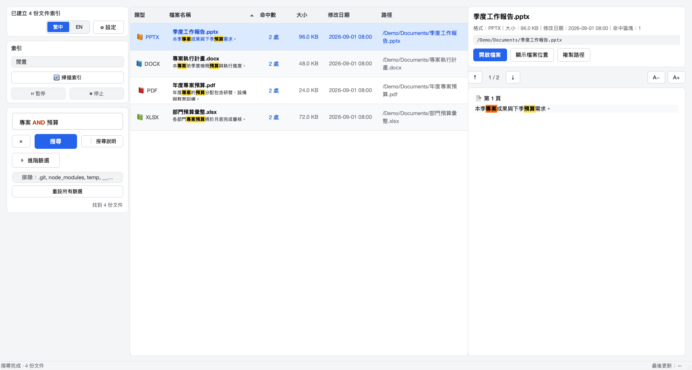
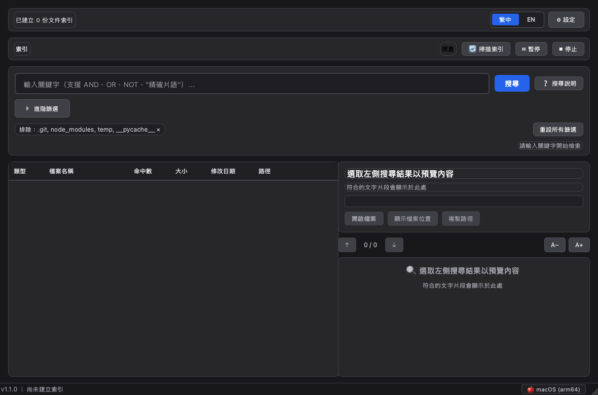
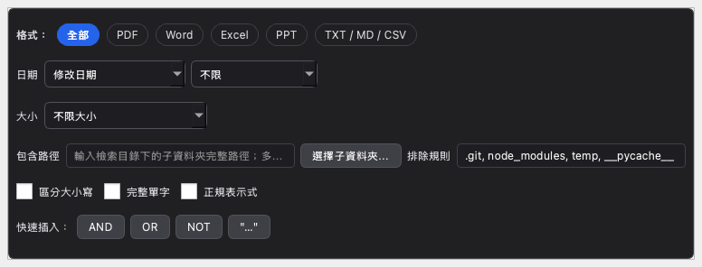

# 本機多格式文件關鍵字檢索系統 (DocSearcher)

一套支援 **Windows、macOS 與 Linux** 的高效能、跨平台純 Python 本機文件內文全文檢索軟體。程式會在啟動時自動識別作業系統與硬體架構，套用相應字型、介面圓角、深淺色外觀，以及原檔／檔案管理器開啟方式。

---

## 🌟 核心特色

1. **純 Python 跨平台原生體驗**：
   - 基於 **PySide6 (Qt for Python)** 打造，無 Chromium/Electron 記憶體與安裝包負擔，啟動迅速、滾動流暢。
   - 自動識別 Windows 10/11、macOS、Linux 與 x86_64/ARM64，不需手動選擇平台。
2. **多格式全支援（涵蓋新舊版 Office）**：
   - **PDF**：`.pdf`（PyMuPDF 高速向量文字流抽取與頁碼定位）
   - **Word**：新版 `.docx`（python-docx）與 舊版 `.doc`（純 Python OLE 串流解析）
   - **Excel**：新版 `.xlsx`（openpyxl 串流唯讀讀取）與 舊版 `.xls`（xlrd 支援）
   - **PowerPoint**：新版 `.pptx`（python-pptx）與 舊版 `.ppt`（純 Python OLE 串流解析）
   - **純文字**：`.txt`, `.md`, `.csv`（多國語系編碼自適應）
3. **輕量極速，無 OCR 負擔**：
   - 專注於文件內嵌文字流抽取，無需昂貴 GPU 或笨重 OCR 影像模型，幾秒內即可為數百至數千份文件建立完備索引。
4. **SQLite FTS5 + jieba 中英文全文檢索**：
   - 內建 BM25 相關度評分，支援繁簡中文、英文混合詞組、精確片語（`"..."`）與布林運算（`AND` / `OR` / `NOT`）。
   - 支援 `filename:關鍵字`／`檔名:關鍵字`直接尋找檔名，並提供查詢格式錯誤提示。
   - 搜尋框即時以不同顏色標示布林運算子、精確片語與特殊符號，並提供 AND／OR／NOT／引號快速插入。
   - 支援修改日期或建立日期（過去 24 小時、7 天、30 天、1 年及自訂區間）、檔案大小級距與 KB／MB／GB 自訂門檻。
   - 可限制特定子資料夾、設定排除路徑規則，以及切換區分大小寫、完整單字、Python 正規表示式。
   - 目前篩選條件會顯示為可移除徽章，可一鍵重設，並於重新啟動後保留。
   - 進階篩選以可保持開啟的獨立面板呈現，避免壓縮搜尋結果與預覽；下拉選單可超出面板邊界完整顯示。
   - 介面內建中英文搜尋說明，以及 Enter、Cmd/Ctrl+F、Esc 快捷操作。
5. **即時上下文預覽與系統深度整合**：
   - 命中關鍵字以黃底粗體高亮，清晰標示所在位置（如：第 3 頁、工作表: 損益表、投影片 2）。
   - 搜尋結果可依類型、名稱、命中數、大小、修改日期與路徑排序，並直接顯示命中摘要。
   - 預覽提供上一個／下一個命中位置、命中計數與 A−／A+ 文字縮放。
   - 按下 **Enter** 或雙擊直接以系統預設程式開啟原檔。
   - 支援右鍵快速開啟檔案所在資料夾（Windows Explorer / macOS Finder / Linux 桌面檔案管理器）。
6. **可恢復且適應外部儲存的索引流程**：
   - 支援重新掃描、暫停、恢復與安全停止；索引完成後會自動刷新目前搜尋。
   - 網路磁碟、外接裝置或權限暫時不可用時保留既有索引，避免誤判文件已刪除。
   - 自動合併重複／上下層檢索目錄並防止符號連結循環，降低重複掃描與停擺風險。
7. **緊湊、雙語且狀態清楚的操作介面**：
   - 完整支援繁體中文與英文即時切換，並保存語言偏好。
   - 目錄與外觀設定收進可折疊設定區；掃描、暫停、繼續、停止仍可快速操作。
   - 索引狀態清楚顯示閒置、掃描中、建立索引中、已暫停與完成，以及檔案計數與百分比。
   - 搜尋與索引採序列化協調，避免同時大量讀寫造成停擺；等候中的搜尋會自動接續執行。

---

## 🖼️ 介面截圖

| 淺色模式 | 深色模式 |
| --- | --- |
|  |  |



---

## 📂 專案目錄結構

```
doc_searcher/
├── core/
│   ├── config.py             # 設定檔持久化 (記錄已選目錄、UI 偏好)
│   ├── i18n.py               # 繁中／英文執行期語系資源
│   ├── database.py           # SQLite3 連線與 FTS5 虛擬全文資料表
│   ├── indexer.py            # 文件解析調度、jieba 分詞與批次索引寫入
│   ├── scanner.py            # 資料夾遞迴掃描、過濾暫存檔 (~$*)、增量比對
│   ├── searcher.py           # 查詢語法剖析、FTS5 檢索與 Snippet 摘要高亮
│   └── version.py            # 應用程式版本號與更新紀錄（唯一版本來源）
├── parsers/
│   ├── base.py               # DocumentParser 抽象介面與 PageSegment 資料結構
│   ├── pdf_parser.py         # PyMuPDF PDF 提取器
│   ├── docx_parser.py        # python-docx 提取器
│   ├── doc_parser.py         # 舊版 Word 97-2003 (.doc) 純 Python OLE 提取器
│   ├── pptx_parser.py        # python-pptx 投影片與備忘錄提取器
│   ├── ppt_parser.py         # 舊版 PPT 97-2003 (.ppt) OLE 提取器
│   ├── xlsx_parser.py        # openpyxl 唯讀工作表文字提取器
│   ├── xls_parser.py         # 舊版 Excel 97-2003 (.xls) xlrd 提取器
│   └── text_parser.py        # 純文字與 Markdown 編碼自適應提取器
├── ui/
│   ├── app.py                # PySide6 Application 初始化與高解析度縮放設定
│   ├── main_window.py        # 主視窗（目錄選擇、搜尋列、過濾標籤、分割檢視）
│   ├── search_input.py       # 即時搜尋語法著色輸入框
│   ├── result_table.py       # 搜尋結果表格（自定義格式圖示、快捷鍵操作）
│   ├── preview_panel.py      # 右側內文摘要預覽面板 (HTML 標記高亮)
│   ├── theme.py              # 深淺色主題與依作業系統調整字型、圓角
│   └── worker.py             # QThread 非同步背景任務 (索引與搜尋不凍結視窗)
├── utils/
│   ├── os_detector.py        # 作業系統版本與硬體架構偵測
│   ├── platform_helper.py    # 跨平台開檔與 Finder/檔案總管呼叫
│   ├── resource_path.py      # 打包後 (sys._MEIPASS) 與原始碼執行皆可用的資源路徑解析
│   └── text_helper.py        # jieba 分詞預處理、HTML 標籤過濾與 Snippet 生成
├── tests/
│   ├── sample_generator.py   # 自動產生各格式測試檔案之腳本
│   ├── test_parsers.py       # 各格式解析器單元測試
│   ├── test_indexer.py       # 增量索引與 SQLite FTS5 測試
│   ├── test_searcher.py      # 查詢語法、格式過濾與高亮測試
│   ├── test_os_adaptation.py # 作業系統偵測與原生操作適配測試
│   ├── test_ui_features.py   # 語系、排序與預覽導覽等介面回歸測試
│   └── sample_files/         # 各格式測試樣本文件
├── scripts/
│   └── generate_icon.py      # 產生應用程式圖示 (.ico / .png)
├── assets/                   # 應用程式圖示
├── main.py                   # 程式進入點 (支援 GUI 與 CLI 兩種模式)
├── install.bat               # Windows 一鍵安裝（Python、VC++ 運行庫、venv、桌面捷徑）
├── run_windows.bat           # Windows 啟動器（未安裝時自動呼叫 install.bat）
├── packaging/
│   ├── build_mac.sh          # macOS 建置腳本
│   ├── build_win.ps1         # Windows PowerShell 建置腳本
│   ├── doc_searcher_mac.spec # macOS .app 的 PyInstaller 設定
│   ├── doc_searcher_win.spec # Windows 單一檔案 .exe 的 PyInstaller 設定
│   └── installer_inno.iss    # Windows 安裝程式 (Inno Setup 6) 腳本
├── docs/screenshots/         # README 介面截圖
├── requirements.txt          # 執行期依賴套件清單
└── requirements-dev.txt      # 開發與測試用依賴 (pytest)
```

---

## 🚀 快速安裝與使用

### 1. 建立 Python 虛擬環境並安裝依賴

```bash
# 複製或進入專案資料夾
cd doc_searcher

# 建立虛擬環境 (建議 Python 3.8 ~ 3.14)
python3 -m venv venv

# 啟用虛擬環境
# macOS / Linux:
source venv/bin/activate
# Windows (PowerShell):
# .\venv\Scripts\Activate.ps1

# 安裝所需套件
pip install -r requirements.txt
```

> Windows 也可直接雙擊 `install.bat`：自動安裝 Python（若尚未安裝）、Visual C++ 運行庫、虛擬環境與套件，並建立桌面捷徑；之後以 `run_windows.bat` 啟動。

### 2. 啟動桌面圖形介面 (GUI)

直接執行 `main.py` 即可啟動桌面視窗：

```bash
python main.py
```

- 展開上方 **「設定」**，點選 **「➕ 選擇資料夾...」** 指定要檢索的文件目錄（可多選）。
- 系統將在背景建立索引，進度條顯示於狀態列，介面保持流暢無阻。
- 在搜尋框輸入關鍵字（例如 `預算`、`"保密協定"`、`專案 AND 2026`），即刻於左側瀏覽結果，右側查看高亮內文！
- 點選「進階篩選」可設定日期、大小、包含子資料夾、排除規則與匹配模式。排除規則變更後會自動重新掃描。

> 建立日期優先使用作業系統提供的檔案出生時間；若平台未提供，使用檔案狀態變更時間。舊索引會在資料庫升級時回填此欄位。

### 3. 命令列檢索 (CLI 模式，適合批次或終端使用者)

無需啟動圖形視窗，亦可透過參數快速檢索：

```bash
# 基本檢索
python main.py --dir /path/to/documents --search "專案預算"

# 依格式篩選 (支援: pdf, word, excel, ppt, text)
python main.py --dir /path/to/documents --search "專案預算" --type excel
```

### 4. 打包成免安裝獨立程式

終端使用者不需安裝 Python 或任何套件；只有建置機器需要 Python 3。

| 平台 | 建置指令 | 輸出 |
| --- | --- | --- |
| macOS（依建置機器架構：arm64 / x86_64） | `packaging/build_mac.sh` | `dist/DocSearcher.app`、`dist/DocSearcher-macOS-<arch>.zip` |
| Windows 10 / 11 | `powershell -ExecutionPolicy Bypass -File .\packaging\build_win.ps1` | `dist\DocSearcher.exe`（單一可攜執行檔） |

- 請在專案根目錄執行建置腳本；輸出位於根目錄的 `dist/`。
- macOS 使用 `packaging/doc_searcher_mac.spec`（onedir `.app`，PyInstaller 6 已不建議在 `.app` 內使用 onefile）；Windows 使用 `packaging/doc_searcher_win.spec`（onefile、無主控台視窗）。
- 若需 Windows 安裝程式，先建置 `DocSearcher.exe`，再以 Inno Setup 6 編譯 `packaging/installer_inno.iss`，輸出至 `setup_output/`。
- GitHub Actions：`tests.yml` 於 Linux／Windows／macOS 執行 pytest；`build_windows.yml` 與 `build_macos.yml`（Apple Silicon 與 Intel）會自動上傳建置成品。
- 版本號只需修改 `core/version.py` 的 `APP_VERSION`：macOS `.app`、Windows `.exe` 檔案資訊與 Inno Setup 安裝程式皆自動沿用。
- 程式內讀取打包資源請使用 `utils.resource_path.resource_path("assets/...")`，它會在打包後自動改用 `sys._MEIPASS`。

#### macOS Gatekeeper（未簽署版本）

建置結果僅為 ad-hoc 簽署、未經 Apple 公證。從網路或其他電腦取得後首次開啟若顯示「已損毀」或「無法驗證開發者」，請先清除隔離屬性：

```bash
xattr -cr /Applications/DocSearcher.app
```

Windows 若出現 SmartScreen 提示，請點選「其他資訊」→「仍要執行」。

---

## 🧪 執行自動化測試

專案內建完備的單元與整合測試，包含 sample 檔案產生器：

```bash
# 0. 安裝測試用依賴
pip install -r requirements-dev.txt

# 1. 產生測試用多格式文件
python -m tests.sample_generator

# 2. 執行全套 pytest 測試
pytest tests/ -v
```
