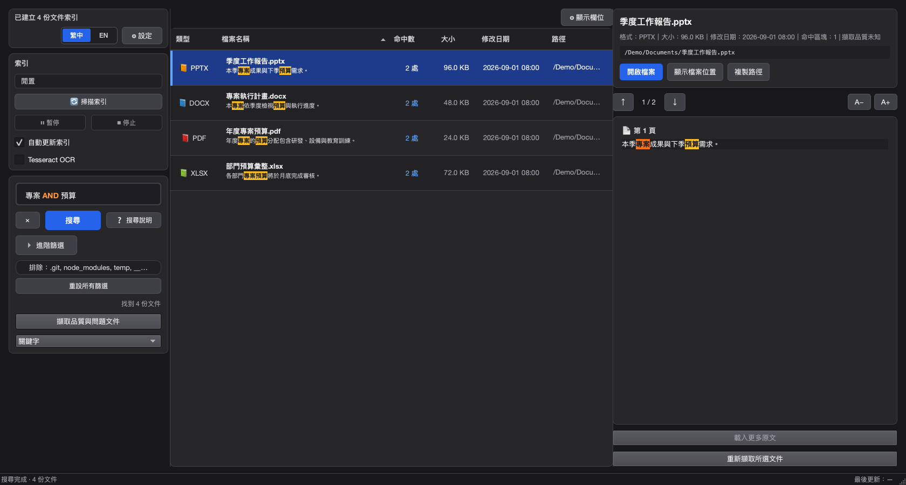
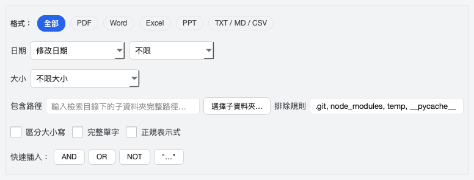
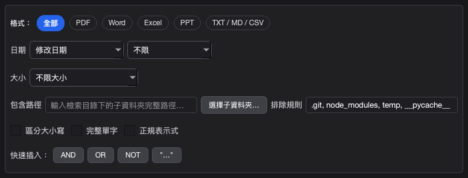

# DocSearcher v1.4.0

**本機多格式文件關鍵字檢索系統 · Local multi-format document keyword search**

[繁體中文](#繁體中文) · [English](#english)

---

## ✨ v1.4.0 更新重點 · What's new in v1.4.0

| 繁體中文 | English |
| --- | --- |
| **資料夾自動索引**：資料夾變更會自動增量索引，並提供待處理／錯誤診斷 | **Live indexing**: folder changes are indexed automatically, with pending/error diagnostics |
| **選用 OCR**：Tesseract OCR 預設關閉，可辨識掃描 PDF 與圖片 | **Optional OCR**: Tesseract OCR is off by default and covers scanned PDFs and images |
| **擴充／混合搜尋**：同義詞、英文拼字容錯與選用的本機向量檢索 | **Expanded/hybrid search**: synonyms, English typo matching and optional local vector retrieval |
| **擷取品質**：保存警告並可重新處理選定文件 | **Extraction quality**: warnings are stored and selected documents can be reprocessed |
| **命中次數**：以原文出現次數計算，預覽可逐一跳至每個位置 | **Hit counts**: count original-text occurrences; the preview steps through each one |

---

## ✨ v1.3.1 更新重點 · What's new in v1.3.1

| 繁體中文 | English |
| --- | --- |
| **繁簡中文互搜**：輸入簡體可找到繁體文件，反之亦然，預覽仍顯示文件原文字元 | **Traditional ↔ Simplified Chinese**: a Simplified query finds Traditional documents and vice versa; the preview shows the characters as written |
| **英文詞形還原**：`outstand`／`outstanding`／`outstandings` 互相命中；區分大小寫與完整單字仍要求完全相同 | **English stemming**: `outstand`, `outstanding` and `outstandings` find each other; match case and whole word still mean the exact word |
| **含標點符號的查詢**：`A-`、`2023-01-03`、`snake_case`、`Section 1 (Paragraphs)` 現在可正確檢索 | **Queries with punctuation**: `A-`, `2023-01-03`, `snake_case` and `Section 1 (Paragraphs)` now work |
| **中文詞更精確**：搜尋 `升等` 不再命中僅是字元分散出現的文件 | **More exact Chinese words**: searching `升等` no longer matches text where the characters merely appear apart |
| **開檔失敗會說明原因**：檔案已被刪除或無對應程式時，預覽面板顯示提示 | **Clear feedback when opening fails**: the preview panel explains a missing file or a missing app |
| **索引自動升級**：首次啟動會自動更新既有索引（約每 1 萬份文件 15 秒），並先備份 | **Automatic index upgrade**: the first launch upgrades your existing index (about 15 s per 10,000 documents), after backing it up |

---

# 繁體中文

一套支援 **Windows、macOS 與 Linux** 的高效能、跨平台純 Python 本機文件內文全文檢索軟體。程式會在啟動時自動識別作業系統與硬體架構，套用相應字型、介面圓角、深淺色外觀，以及原檔／檔案管理器開啟方式。

---

## 🌟 核心特色

1. **純 Python 跨平台原生體驗**：
   - 基於 **PySide6 (Qt for Python)** 打造，無 Chromium/Electron 記憶體與安裝包負擔，啟動迅速、滾動流暢。
   - 自動識別 Windows 10/11、macOS、Linux 與 x86_64/ARM64，不需手動選擇平台。
2. **多格式全支援（涵蓋新舊版 Office）**：
   - **PDF**：`.pdf`（PyMuPDF 高速向量文字流抽取與頁碼定位）
   - **Word**：新版 `.docx`（python-docx）與 舊版 `.doc`（純 Python OLE 串流解析，盡力擷取：可能夾雜樣式／字型名稱等雜訊）
   - **Excel**：新版 `.xlsx`（openpyxl 串流唯讀讀取）與 舊版 `.xls`（xlrd 支援）
   - **PowerPoint**：新版 `.pptx`（python-pptx）與 舊版 `.ppt`（純 Python OLE 串流解析，盡力擷取：全部投影片合併為單一區段）
   - **純文字**：`.txt`, `.md`, `.csv`（依 BOM 辨識 UTF-8／UTF-16／UTF-32，並偵測無 BOM 的 UTF-16；其餘依序嘗試 UTF-8、Big5、GBK。無 BOM 的 GBK 可能被誤判為 Big5）
   - 路徑可含中日韓文字、emoji、空白、`%`、`_`、`[ ]` 等字元；在 macOS 上，以不同 Unicode 正規化形式（NFC／NFD）拼寫的同一路徑視為同一個檔案。從 1.2.0 升級後，第一次重新掃描會把以 NFD 儲存的舊索引項目重新建立一次。
   - 加密、損毀、空白或無法讀取的文件會記錄原因並略過，不會中斷整批索引；僅設定擁有者密碼（限制列印／複製）的 PDF 仍可擷取文字。
3. **本機文字擷取與掃描文件 OCR**：
   - 原生文字快速索引；勾選「Tesseract OCR」（預設關閉，CLI 用 `--ocr`）後，掃描 PDF 與 PNG/JPEG/TIFF 會使用本機 Tesseract OCR。需安裝引擎與中英文語言資料；關閉時略過的頁面與辨識失敗都會列入診斷。詳見[全資料夾搜尋設定](docs/full-folder-search.md)。
4. **SQLite FTS5 + jieba 中英文全文檢索**：
   - 內建 BM25 相關度評分，支援繁簡中文互搜（輸入簡體可找到繁體文件，反之亦然；以字為單位轉換，不做「軟體／软件」這類地區用語對應；正規表示式模式不轉換，高亮顯示文件原文字元）、英文混合詞組、英文詞形還原（`outstand`／`outstanding`／`outstandings` 互相命中；區分大小寫與完整單字仍要求完全相同）、精確片語（`"..."`）與布林運算（`AND` / `OR` / `NOT`）。
   - 每個中文查詢詞（例如 `計畫`、`升等`、單字 `計`）必須在同一區塊的原文連續出現，不受斷詞邊界影響；空白分隔的詞維持 AND 語意；含標點符號的查詢（`A-`、`2023-01-03`、`snake_case`、`Section 1 (Paragraphs)`）可照輸入內容檢索。
   - 支援 `filename:關鍵字`／`檔名:關鍵字`直接尋找檔名，並提供查詢格式錯誤提示。
   - 搜尋框即時以不同顏色標示布林運算子、精確片語與特殊符號，並提供 AND／OR／NOT／引號快速插入。
   - 支援修改日期或建立日期（過去 24 小時、7 天、30 天、1 年及自訂區間）、檔案大小級距與 KB／MB／GB 自訂門檻。
   - 可限制特定子資料夾、設定排除路徑規則，以及切換區分大小寫、完整單字、Python 正規表示式。
   - 目前篩選條件會顯示為可移除徽章，可一鍵重設，並於重新啟動後保留。
   - 進階篩選以可保持開啟的獨立面板呈現，避免壓縮搜尋結果與預覽；下拉選單可超出面板邊界完整顯示。
   - 介面內建中英文搜尋說明，以及 Enter、Cmd/Ctrl+F、Esc 快捷操作。
5. **即時上下文預覽與系統深度整合**：
   - 命中關鍵字以黃底粗體高亮，清晰標示所在位置（如：第 3 頁、工作表: 損益表、投影片 2）。
   - 搜尋結果可依類型、名稱、命中數、大小、修改日期與路徑排序，並直接顯示命中摘要。
   - 預覽提供上一個／下一個命中位置、命中計數與 A−／A+ 文字縮放。
   - 按下 **Enter** 或雙擊直接以系統預設程式開啟原檔；若無法開啟（例如檔案已被刪除），預覽面板會說明原因。
   - 支援右鍵快速開啟檔案所在資料夾（Windows Explorer / macOS Finder / Linux 桌面檔案管理器）。
6. **可恢復且適應外部儲存的索引流程**：
   - 支援重新掃描、暫停、恢復與安全停止；索引完成後會自動刷新目前搜尋。
   - 網路磁碟、外接裝置或權限暫時不可用時保留既有索引，避免誤判文件已刪除。
   - 自動合併重複／上下層檢索目錄並防止符號連結循環，降低重複掃描與停擺風險。
7. **緊湊、雙語且狀態清楚的操作介面**：
   - 完整支援繁體中文與英文即時切換，並保存語言偏好。
   - 外觀支援自動跟隨系統、深色與淺色；切換時同步更新側欄、結果選取、預覽、進階篩選、提示與捲軸，並保留目前結果與預覽位置。
   - 目錄與外觀設定收進可折疊設定區；掃描、暫停、繼續、停止仍可快速操作。
   - 索引狀態清楚顯示閒置、掃描中、建立索引中、已暫停與完成，以及檔案計數與百分比。
   - 搜尋與索引採序列化協調，避免同時大量讀寫造成停擺；等候中的搜尋會自動接續執行。

---

## 🖼️ 介面截圖

| 淺色模式 | 深色模式 |
| --- | --- |
|  |  |

兩種外觀使用相同的示範資料與選取結果，方便比較文字、選取色與關鍵字高亮；圖片中的文件與路徑皆為合成範例。

| 進階篩選（淺色） | 進階篩選（深色） |
| --- | --- |
|  |  |

展開「設定」後，點選外觀按鈕即可依序切換「自動 → 深色 → 淺色」。自動模式會跟隨系統外觀變更，手動模式則維持所選外觀。

開發者可在安裝專案後執行 `python scripts/capture_screenshots.py` 重建截圖。腳本使用 Qt offscreen 與暫存設定／資料庫，不會讀寫個人索引；字型與控制項細節可能隨平台而異。

DocSearcher 啟動時會把主視窗置中；若也想讓其他應用程式的新視窗自動置中，請參閱[macOS／Windows 選用腳本與安裝說明](docs/center-on-screen.md)。

---

## 📂 專案目錄結構

```
doc_searcher/
├── src/doc_searcher/
│   ├── __main__.py           # python -m doc_searcher 進入點
│   ├── cli.py                # GUI 與 CLI 進入點（doc-searcher 指令）
│   ├── version.py            # 應用程式版本號與更新紀錄（唯一版本來源）
│   ├── config.py             # 設定檔持久化 (記錄已選目錄、UI 偏好)
│   ├── assets/               # 應用程式圖示與 OpenCC 字元對照表（套件資料）
│   ├── indexing/
│   │   ├── scanner.py        # 資料夾遞迴掃描、過濾暫存檔 (~$*)、增量比對
│   │   └── indexer.py        # 文件解析調度、jieba 分詞與批次索引寫入
│   ├── search/
│   │   ├── searcher.py       # 查詢語法剖析、FTS5 檢索與 Snippet 摘要高亮
│   │   ├── search_service.py # 不依賴介面的搜尋／索引服務（供 MCP 伺服器使用）
│   │   ├── text_helper.py    # jieba 分詞預處理、HTML 標籤過濾與 Snippet 生成
│   │   ├── script_fold.py    # 繁簡中文轉換（以字為單位）
│   │   └── stemming.py       # 以 SQLite porter 分詞器取得英文詞幹（供高亮使用）
│   ├── storage/
│   │   ├── database.py       # SQLite3 連線與 FTS5 虛擬全文資料表
│   │   └── migrations.py     # 具版本的資料庫遷移（先備份、失敗即回復）
│   ├── parsers/
│   │   ├── base.py           # DocumentParser 抽象介面與 PageSegment 資料結構
│   │   ├── pdf_parser.py     # PyMuPDF PDF 提取器
│   │   ├── docx_parser.py    # python-docx 提取器
│   │   ├── doc_parser.py     # 舊版 Word 97-2003 (.doc) 純 Python OLE 提取器
│   │   ├── pptx_parser.py    # python-pptx 投影片與備忘錄提取器
│   │   ├── ppt_parser.py     # 舊版 PPT 97-2003 (.ppt) OLE 提取器
│   │   ├── xlsx_parser.py    # openpyxl 唯讀工作表文字提取器
│   │   ├── xls_parser.py     # 舊版 Excel 97-2003 (.xls) xlrd 提取器
│   │   └── text_parser.py    # 純文字與 Markdown 編碼自適應提取器
│   ├── desktop/
│   │   ├── app.py            # PySide6 Application 初始化與高解析度縮放設定
│   │   ├── main_window.py    # 主視窗（目錄選擇、搜尋列、過濾標籤、分割檢視）
│   │   ├── i18n.py           # 繁中／英文執行期語系資源
│   │   ├── search_input.py   # 即時搜尋語法著色輸入框
│   │   ├── result_table.py   # 搜尋結果表格（自定義格式圖示、快捷鍵操作）
│   │   ├── preview_panel.py  # 右側內文摘要預覽面板 (HTML 標記高亮)
│   │   ├── theme.py          # 深淺色主題與依作業系統調整字型、圓角
│   │   └── worker.py         # QThread 非同步背景任務 (索引與搜尋不凍結視窗)
│   ├── integrations/
│   │   └── mcp_server.py     # MCP 伺服器（stdio），供 Claude Code／Claude Desktop 使用
│   └── platform/
│       ├── os_detector.py    # 作業系統版本與硬體架構偵測
│       ├── platform_helper.py # 跨平台開檔與 Finder/檔案總管呼叫
│       └── resource_path.py  # 打包後 (sys._MEIPASS) 與原始碼執行皆可用的資源路徑解析
├── tests/
│   ├── sample_generator.py   # 自動產生各格式測試檔案之腳本
│   ├── fixtures/             # 合成的舊版資料庫／設定檔（遷移測試用）
│   ├── search_plan/          # 測試計畫的資料集產生器與其案例模組
│   ├── test_cli.py           # CLI 結束代碼與跨目錄索引保護
│   ├── test_imports.py       # 匯入邊界（輕量模組不載入 Qt／jieba）
│   ├── test_parsers.py       # 各格式解析器單元測試
│   ├── test_indexer.py       # 增量索引與 SQLite FTS5 測試
│   ├── test_searcher.py      # 查詢語法、格式過濾與高亮測試
│   ├── test_os_adaptation.py # 作業系統偵測與原生操作適配測試
│   ├── test_ui_features.py   # 語系、排序與預覽導覽等介面回歸測試
│   ├── test_search_service.py # 搜尋服務（搜尋、狀態、重新索引、文件文字）測試
│   ├── test_mcp_server.py    # MCP 協定層與 stdio 往返測試
│   └── sample_files/         # 各格式測試樣本文件（含舊版 .doc／.ppt／.xls）
├── scripts/
│   ├── capture_screenshots.py # 以合成資料重建深淺色 README 截圖
│   ├── generate_icon.py      # 產生應用程式圖示 (.ico / .png)
│   └── update_constraints.sh # 重新產生並驗證 constraints/ci.txt
├── install.bat               # Windows 一鍵安裝（Python、VC++ 運行庫、venv、桌面捷徑）
├── run_windows.bat           # Windows 啟動器（未安裝時自動呼叫 install.bat）
├── packaging/
│   ├── build_mac.sh          # macOS 建置腳本
│   ├── build_win.ps1         # Windows PowerShell 建置腳本
│   ├── doc_searcher_mac.spec # macOS .app 的 PyInstaller 設定
│   ├── doc_searcher_win.spec # Windows 單一檔案 .exe 的 PyInstaller 設定
│   └── installer_inno.iss    # Windows 安裝程式 (Inno Setup 6) 腳本
├── docs/                     # 基準紀錄、ADR、測試計畫、執行紀錄與 README 介面截圖
├── constraints/              # CI／發行版建置使用的鎖定依賴（含雜湊），見 constraints/README.md
└── pyproject.toml            # 專案中繼資料、依賴範圍（dev／mcp／package 選項）與指令進入點
```

---

## 🚀 快速安裝與使用

### 1. 建立 Python 虛擬環境並安裝依賴

```bash
# 複製或進入專案資料夾
cd doc_searcher

# 建立虛擬環境 (支援 Python 3.10 ~ 3.14)
python3 -m venv venv

# 啟用虛擬環境
# macOS / Linux:
source venv/bin/activate
# Windows (PowerShell):
# .\venv\Scripts\Activate.ps1

# 安裝所需套件（pyproject.toml 為依賴的唯一來源）
pip install .
# 開發者：可編輯安裝，並加入測試與 MCP 依賴
pip install -e '.[dev,mcp]'
```

> **自 1.2.0 原始碼升級**：程式碼已移至 `src/doc_searcher/`，`main.py` 與 `mcp_server.py` 已移除。請在既有虛擬環境執行一次 `pip install -e .`（Windows 可重新執行 `install.bat`，會一併更新桌面捷徑），並將 MCP 用戶端設定改為 `venv/bin/doc-searcher-mcp`。設定檔與索引位置不變。

> **自 1.3.0 升級**：第一次啟動時會自動升級既有索引（繁簡轉換與英文詞形還原）；不會重新讀取檔案，且會先備份。啟動時約需每 1 萬份文件 15 秒。

> **可重現安裝**：CI 與打包腳本安裝 `constraints/ci.txt` 內固定版本且驗證雜湊的依賴；更新流程見 [constraints/README.md](constraints/README.md)。

> **Python 支援政策**：3.10（mcp、PyMuPDF、PySide6 的最低需求）至 3.14（PySide6 目前上限）。CI 會驗證此範圍。安裝後可使用 `doc-searcher`（GUI／CLI，`--version`、`--help` 不會開啟視窗）與 `doc-searcher-mcp` 指令。

> Windows 也可直接雙擊 `install.bat`：自動安裝 Python（若尚未安裝）、Visual C++ 運行庫、虛擬環境與套件，並建立桌面捷徑；之後以 `run_windows.bat` 啟動。
>
> macOS 可直接雙擊 `start_doc_searcher.command`：首次執行會自動建立虛擬環境並安裝套件，之後直接啟動視窗（首次若被 Gatekeeper 擋下，請右鍵選「打開」）。

### 2. 啟動桌面圖形介面 (GUI)

安裝後執行 `doc-searcher`（或 `python -m doc_searcher`）即可啟動桌面視窗：

```bash
doc-searcher
```

- 展開上方 **「設定」**，點選 **「➕ 選擇資料夾...」** 指定要檢索的文件目錄（可多選）。
- 系統將在背景建立索引，進度條顯示於狀態列，介面保持流暢無阻。
- 在搜尋框輸入關鍵字（例如 `預算`、`"保密協定"`、`專案 AND 2026`），即刻於左側瀏覽結果，右側查看高亮內文！
- 點選「進階篩選」可設定日期、大小、包含子資料夾、排除規則與匹配模式。排除規則變更後會自動重新掃描。

> 設定檔 `config.json` 與索引 `index.db` 預設存放於 `~/.doc_searcher`（可用 `DOC_SEARCHER_DATA_DIR` 覆寫）；家目錄無法寫入時改用作業系統的使用者資料夾。設定檔以原子方式寫入，格式錯誤的欄位會個別還原為預設值，無法解析的檔案會先備份為 `config.json.corrupt-<時間>`。詳見 [ADR 0001](docs/adr/0001-data-directory.md)。索引資料庫具版本號（`PRAGMA user_version`）：升級前會先備份為 `index.db.pre-migration.bak`，升級失敗會完整回復；遇到被鎖定、唯讀、損毀或較新版本建立的索引時，程式會顯示原因與處理方式，不會自動刪除或重建。

> 建立日期優先使用作業系統提供的檔案出生時間；若平台未提供，使用檔案狀態變更時間。舊索引會在資料庫升級時回填此欄位。

### 3. 命令列檢索 (CLI 模式，適合批次或終端使用者)

無需啟動圖形視窗，亦可透過參數快速檢索：

```bash
# 基本檢索
doc-searcher --dir /path/to/documents --search "專案預算"

# 依格式篩選 (支援: pdf, word, excel, ppt, text)
doc-searcher --dir /path/to/documents --search "專案預算" --type excel
```

CLI 的標準輸出只包含搜尋結果；進度與診斷訊息寫入標準錯誤（可用 `DOC_SEARCHER_LOG_LEVEL=INFO` 或 `DEBUG` 顯示更多記錄）。CLI 只會更新 `--dir` 目錄內的索引，其他目錄的索引不受影響。`--dir` 與 `--search` 必須同時指定。結束代碼：`0` 成功、`1` 目錄無法存取（既有索引保留不變）、`2` 參數錯誤、`3` 無可寫入的資料資料夾。

### 4. 打包成免安裝獨立程式

終端使用者不需安裝 Python 或任何套件；只有建置機器需要 Python 3。

| 平台 | 建置指令 | 輸出 |
| --- | --- | --- |
| macOS（Apple Silicon / arm64） | `packaging/build_mac.sh` | `dist/DocSearcher.app`、`dist/DocSearcher-macOS-arm64.zip` |
| Windows 10 / 11 | `powershell -ExecutionPolicy Bypass -File .\packaging\build_win.ps1` | `dist\DocSearcher.exe`（單一可攜執行檔） |

- 請在專案根目錄執行建置腳本；輸出位於根目錄的 `dist/`。
- macOS 使用 `packaging/doc_searcher_mac.spec`（onedir `.app`，PyInstaller 6 已不建議在 `.app` 內使用 onefile）；Windows 使用 `packaging/doc_searcher_win.spec`（onefile、無主控台視窗）。
- 建置腳本會在打包後執行 `scripts/verify_build.py`：於成品內執行 `--self-check`（解析器、jieba 詞典、繁簡轉換表、SQLite FTS5、英文詞形還原、Qt、圖示資源），並確認版本與 CPU 架構，失敗即中止、不產生壓縮檔。亦可手動執行：`DocSearcher.app/Contents/MacOS/DocSearcher --self-check`，或在 Windows 上 `DocSearcher.exe --self-check --report check.txt`（無主控台視窗，結果寫入檔案）。
- 若需 Windows 安裝程式，先建置 `DocSearcher.exe`，再以 Inno Setup 6 編譯 `packaging/installer_inno.iss`，輸出至 `setup_output/`。
- GitHub Actions：`tests.yml` 執行品質檢查與 Linux／Windows／macOS 測試；`build.yml` 在 macOS Apple Silicon 與 Windows x64 建置並以自我檢查驗證，成品名稱與發行檔名相同（`DocSearcher-macOS-arm64.zip`、`DocSearcher-Windows-x64.exe`）。
- 發布版本：先修改 `src/doc_searcher/version.py` 的 `APP_VERSION`，再推送相同版本的 `vX.Y.Z` 標籤（或在 GitHub「Draft a new release」頁面建立該標籤）。`release.yml` 先以數秒檢查標籤與版本是否一致（不一致即停止，不進行安裝或打包），接著重用 `tests.yml` 與 `build.yml`；只有 macOS arm64 與 Windows x64 建置和全部測試都成功，才會上傳兩個成品與 `SHA256SUMS.txt`。每個標籤只會觸發一次，同一標籤的執行會排隊而不會互相中斷。
- 程式碼簽署與公證（macOS Developer ID／notarization、Windows Authenticode）預設關閉；設定憑證後以儲存庫變數 `SIGNING_ENABLED=true` 啟用，詳見 [docs/signing.md](docs/signing.md)。啟用後任何簽署或驗證失敗都會阻止發布。
- 試跑發布：在 Actions 手動執行 `Release`，輸入既有標籤並保持 `publish` 未勾選，成品與校驗碼會以 `release-dry-run` 上傳而不建立 Release。
- 版本號只需修改 `src/doc_searcher/version.py` 的 `APP_VERSION`：macOS `.app`、Windows `.exe` 檔案資訊與 Inno Setup 安裝程式皆自動沿用。
- 程式內讀取打包資源請使用 `doc_searcher.platform.resource_path.resource_path("assets/...")`，它會在打包後自動改用 `sys._MEIPASS`。

#### macOS Gatekeeper（未簽署版本）

建置結果僅為 ad-hoc 簽署、未經 Apple 公證。從網路或其他電腦取得後首次開啟若顯示「已損毀」或「無法驗證開發者」，請先清除隔離屬性：

```bash
xattr -cr /Applications/DocSearcher.app
```

Windows 若出現 SmartScreen 提示，請點選「其他資訊」→「仍要執行」。

---

### 搜尋完整性、命中次數與擷取品質

自動監控資料夾、XLSX 隱藏儲存格註解、PPTX 群組內容與本機語意／同義詞搜尋已加入；設定與限制見[全資料夾搜尋](docs/full-folder-search.md)。

- 「命中數」是原文中的實際出現次數，與命中區塊數、摘要數分開。相同位置去重、重疊的正向命中合併，緊鄰的不同命中仍分開；NOT 不增加命中數。引號片語以整個片語計算一次。
- 搜尋先選文件再載入其命中區塊。結果可按「載入更多文件」繼續；更新索引或變更查詢後，舊的游標／位置需重新搜尋。預覽的上一個／下一個可走訪每次命中；「載入更多原文」按 2,048 字元分頁，不把大型文件一次繪製成 HTML。
- Word 包含依序的本文／表格、頁首／頁尾與文字方塊。頁碼無法由 python-docx 推算；位置標示實際 part／段落。Excel 顯示工作表與儲存格（例如 `Sheet1!B12`），公式來源與快取值分開標示；未有快取值的公式仍可搜尋，且會顯示警告，程式不計算公式。
- 「擷取品質與問題文件」列出無文字、部分擷取、解析失敗及未知品質；選取後可重新擷取，即使大小／修改時間未變。舊索引的品質為未知，搜尋索引升級僅使用已儲存的原文；重新擷取才會取得新增的 Office 內容與位置資訊。
- OCR 支援掃描 PDF 與影像，預設關閉；需勾選「Tesseract OCR」或使用 `--ocr`，並安裝 Tesseract 與語言資料。無法保證所有嵌入式 Office 物件，且不解密密碼或執行公式／巨集。PDF 頁面擷取失敗會保留其他頁並列出失敗頁。Regex 超時／取消會報錯，不回傳假裝完整的部分次數；零寬命中以游標線顯示並逐次計算。

CLI 範例（舊的 `--dir ... --search ...` 用法仍可用）：

```bash
doc-searcher --dir /path/to/docs --search '計畫' --limit 20 --json
doc-searcher --dir /path/to/docs --search '計畫' --limit 20 --cursor '<next_cursor>' --json
doc-searcher --dir /path/to/docs --search '會議' --locations 42 --offset 100 --revision 123
doc-searcher --dir /path/to/docs --search '會議' --context '<location JSON>'
doc-searcher --quality --offset 0 --limit 100
doc-searcher --dir /path/to/docs --reprocess /path/to/docs/report.docx
```

MCP／Python 呼叫保留既有結果欄位，並增加 `doc_id`、`segment_count`、`snippet_count`、`count_complete`、`parse_status`、`warnings`。搜尋回傳 `next_cursor`、`has_more`、`total_documents`、`complete`、`revision`；`match_count` 從摘要數修正為實際命中次數，是刻意的相容性變更。位置 `start`／`end` 是原文 Python 字元索引，半開區間 `[start,end)`，不是 UTF-8 位元組或 UTF-16 索引。

## 🤖 MCP 伺服器（Claude Code／Claude Desktop 整合）

`doc-searcher-mcp`（`src/doc_searcher/integrations/mcp_server.py`）以 [Model Context Protocol](https://modelcontextprotocol.io) 將本機索引提供給 AI 用戶端，與桌面程式共用 `~/.doc_searcher` 內的索引與設定（可用 `DOC_SEARCHER_DATA_DIR` 覆寫）。請先在桌面程式加入檢索資料夾並完成索引。

| 類型 | 名稱 | 說明 |
| --- | --- | --- |
| 工具 | `search_documents` | `query`（支援 `"片語"`、AND／OR／NOT、`filename:`）、`formats`（`pdf`／`word`／`excel`／`ppt`／`text`）、`limit`（1–100）。回傳路徑、類型、大小、修改時間、命中位置（頁／工作表／投影片／段落）與 **粗體** 標示的摘要 |
| 工具 | `get_match_locations` / `get_match_context` | 分頁命中位置與原文上下文，附索引 revision；過期位置會報錯 |
| 工具 | `get_problem_documents` / `reprocess_documents` | 分頁擷取品質／警告清單，以及背景重新擷取所選文件 |
| 工具 | `get_index_status` | 文件數、索引大小、最後更新時間、版本、檢索資料夾與最近一次重新索引狀態 |
| 工具 | `reindex_directory` | 於背景增量重新索引全部檢索資料夾，或其中某個子資料夾；立即返回，以 `get_index_status` 查詢進度。新資料夾需在桌面程式加入 |
| 資源 | `docsearcher://document/{path}` | 已索引文件的完整擷取文字（`path` 為百分比編碼的絕對路徑；搜尋結果附有現成的 `resource_uri`）。只提供索引內的文件，不會讀取索引以外的檔案 |

### 1. 安裝（需 Python 3.10+）

```bash
pip install '.[mcp]'
```

### 2. 加入 Claude Code

```bash
claude mcp add docsearcher -- /絕對路徑/doc_searcher/venv/bin/doc-searcher-mcp
```

Windows 請改用 `venv\Scripts\doc-searcher-mcp.exe`。加入後在 Claude Code 輸入 `/mcp` 確認連線狀態。

### 3. 加入 Claude Desktop

編輯 `claude_desktop_config.json`（macOS：`~/Library/Application Support/Claude/`；Windows：`%APPDATA%\Claude\`），重新啟動 Claude Desktop：

```json
{
  "mcpServers": {
    "docsearcher": {
      "command": "/絕對路徑/doc_searcher/venv/bin/doc-searcher-mcp"
    }
  }
}
```

Windows 範例：`"command": "C:\\path\\to\\doc_searcher\\venv\\Scripts\\doc-searcher-mcp.exe"`。

### 4. 以 MCP Inspector 測試

```bash
# 網頁介面：列出工具、呼叫工具、讀取資源
npx @modelcontextprotocol/inspector venv/bin/doc-searcher-mcp

# 命令列：伺服器指令需放在選項之前
npx @modelcontextprotocol/inspector --cli venv/bin/doc-searcher-mcp --method tools/list
npx @modelcontextprotocol/inspector --cli venv/bin/doc-searcher-mcp \
  --method tools/call --tool-name search_documents --tool-arg 'query=預算' 'limit=5'
```

> 每次 `--cli` 呼叫都會啟動新的伺服器程序並隨即結束，因此背景的 `reindex_directory` 會被中斷；請在網頁介面、Claude Code 或 Claude Desktop 中測試重新索引。

---

## 🧪 執行自動化測試

專案內建完備的單元與整合測試，包含 sample 檔案產生器：

```bash
# 0. 安裝測試用依賴（加上 mcp 選項才會執行 MCP 測試，否則自動略過）
pip install -e '.[dev,mcp]'

# 1. 產生測試用多格式文件
python -m tests.sample_generator

# 2. 執行全套 pytest 測試
pytest tests/ -v

# 3. 與 CI 相同的品質檢查（格式、lint、型別、覆蓋率下限見 pyproject.toml）
ruff format --check . && ruff check . && python -m mypy
pytest --cov=doc_searcher --cov-report=term-missing
```

> 標記 `posix`／`windows`／`macos` 的測試只在對應平台執行，其他平台會顯示略過原因。

檢索測試計畫（[docs/test-plan.md](docs/test-plan.md)）針對可重現的產生資料集執行；可用 `python tests/search_plan/dataset.py OUTDIR` 產生（案例模組會自動產生）。結果、發現與人工檢查清單見 [docs/test-execution-log.md](docs/test-execution-log.md)。

---

# English

A fast, cross-platform, pure-Python full-text search app for local documents on **Windows, macOS and Linux**. At start-up it detects the operating system and hardware architecture and applies the matching fonts, corner radius, light/dark appearance, and the right way to open a file or reveal it in the file manager.

---

## 🌟 Key features

1. **Pure Python, native feel on every platform**:
   - Built on **PySide6 (Qt for Python)**: no Chromium/Electron memory or download-size overhead, quick start-up, smooth scrolling.
   - Detects Windows 10/11, macOS, Linux and x86_64/ARM64 automatically; nothing to choose.
2. **Many formats, including legacy Office**:
   - **PDF**: `.pdf` (PyMuPDF fast text-stream extraction with page numbers)
   - **Word**: `.docx` (python-docx) and legacy `.doc` (pure-Python OLE stream parsing, best effort: style and font names may leak into the text)
   - **Excel**: `.xlsx` (openpyxl streaming read-only) and legacy `.xls` (xlrd)
   - **PowerPoint**: `.pptx` (python-pptx) and legacy `.ppt` (pure-Python OLE stream parsing, best effort: all slides are merged into a single block)
   - **Plain text**: `.txt`, `.md`, `.csv` (UTF-8/UTF-16/UTF-32 detected from the BOM, BOM-less UTF-16 detected; otherwise UTF-8, Big5, GBK are tried in that order. BOM-less GBK may be misread as Big5)
   - Paths may contain CJK characters, emoji, spaces, `%`, `_`, `[ ]`; on macOS, the same path spelled in different Unicode normalization forms (NFC/NFD) counts as one file. After upgrading from 1.2.0, the first rescan re-creates old index entries that were stored in NFD once.
   - Encrypted, corrupt, empty or unreadable documents are logged with a reason and skipped without stopping the whole batch; PDFs with only an owner password (print/copy restrictions) still yield their text.
3. **Local extraction and scanned-document OCR**:
   - Native text is indexed directly; with **Tesseract OCR** checked (off by default; CLI `--ocr`), scanned PDFs and PNG/JPEG/TIFF images use local Tesseract OCR. Install the engine and language data; skipped pages and failures appear in diagnostics. See [full-folder search setup](docs/full-folder-search.md).
4. **SQLite FTS5 + jieba full-text search for Chinese and English**:
   - Built-in BM25 relevance ranking. **Traditional and Simplified Chinese match each other** (a Simplified query finds Traditional documents and vice versa; converted character by character, with no regional vocabulary mapping such as 軟體/软件; regex mode is not converted; the preview highlights the characters as written in the document). **English word forms match each other** (`outstand`, `outstanding` and `outstandings` find one another; match case and whole word still require the exact word). Mixed-language phrases, exact phrases (`"..."`) and boolean operators (`AND` / `OR` / `NOT`) are supported.
   - Each Chinese query term (`計畫`, `升等`, or a single character) must occur contiguously within one segment, independently of token boundaries. Space-separated terms retain AND semantics. Queries containing punctuation (`A-`, `2023-01-03`, `snake_case`, `Section 1 (Paragraphs)`) work as typed.
   - `filename:keyword` / `檔名:keyword` searches file names directly, and malformed queries get a clear error message.
   - The search box colors boolean operators, exact phrases and special characters as you type, with quick-insert buttons for AND/OR/NOT/quotes.
   - Filter by modified or created date (last 24 hours, 7 days, 30 days, 1 year, or a custom range) and by file-size band or a custom KB/MB/GB threshold.
   - Restrict to specific subfolders, set exclusion rules, and toggle match case, whole word and Python regular expressions.
   - Active filters appear as removable badges, can be reset with one click, and persist across restarts.
   - Advanced filters live in a separate panel that can stay open without squeezing the results and preview; dropdown menus can extend beyond the panel edge.
   - The interface includes built-in Chinese/English search help and the shortcuts Enter, Cmd/Ctrl+F and Esc.
5. **Live context preview and deep system integration**:
   - Matches are highlighted in bold on a yellow background, with their location (for example page 3, sheet "P&L", slide 2).
   - Results can be sorted by type, name, hit count, size, modified date and path, and show a snippet of the match.
   - The preview offers previous/next match, a match counter and A−/A+ text zoom.
   - Press **Enter** or double-click to open the original file in the system's default app. If that fails (for example the file was deleted) the preview panel says why.
   - Right-click to open the containing folder (Windows Explorer / macOS Finder / Linux desktop file manager).
6. **Recoverable indexing that copes with external storage**:
   - Rescan, pause, resume and safe stop; the current search refreshes automatically when indexing finishes.
   - When a network drive, external device or permission is temporarily unavailable, the existing index is kept instead of assuming the documents were deleted.
   - Duplicate or nested search folders are merged and symbolic-link loops are prevented, reducing repeated scanning and stalls.
7. **A compact, bilingual interface with clear status**:
   - Traditional Chinese and English can be switched instantly, and the choice is remembered.
   - Appearance follows the system, dark or light; switching updates the sidebar, result selection, preview, advanced filters, tooltips and scroll bars together while keeping the current results and preview position.
   - Folder and appearance settings sit in a collapsible section; scan, pause, resume and stop stay one click away.
   - The index status shows idle, scanning, indexing, paused and done, with file counts and percentage.
   - Search and indexing are coordinated one at a time to avoid stalls from heavy simultaneous reads and writes; a waiting search continues automatically.

---

## 🖼️ Screenshots

| Light mode | Dark mode |
| --- | --- |
|  |  |

Both appearances use the same demo data and selection so the text, selection color and keyword highlight can be compared; all documents and paths in the images are synthetic examples.

| Advanced filters (light) | Advanced filters (dark) |
| --- | --- |
|  |  |

After expanding **Settings**, click the appearance button to cycle through "Auto → Dark → Light". Auto follows the system appearance; a manual choice stays as selected.

Developers can rebuild the screenshots after installing the project with `python scripts/capture_screenshots.py`. The script uses Qt offscreen and a temporary config/database, so it never reads or writes a personal index; fonts and control details may vary by platform.

DocSearcher centers its main window at startup. For optional scripts that center new windows in other apps, see the [macOS and Windows setup guide](docs/center-on-screen.md).

---

## 📂 Project layout

```
doc_searcher/
├── src/doc_searcher/
│   ├── __main__.py           # python -m doc_searcher entry point
│   ├── cli.py                # GUI and CLI entry point (the doc-searcher command)
│   ├── version.py            # App version and release notes (the single source of the version)
│   ├── config.py             # Config persistence (chosen folders, UI preferences)
│   ├── assets/               # App icons and the OpenCC character table (package data)
│   ├── indexing/
│   │   ├── scanner.py        # Recursive folder scan, temp-file filter (~$*), incremental diff
│   │   └── indexer.py        # Parser dispatch, jieba tokenization and batched index writes
│   ├── search/
│   │   ├── searcher.py       # Query parsing, FTS5 search and highlighted snippets
│   │   ├── search_service.py # UI-independent search/index service (used by the MCP server)
│   │   ├── text_helper.py    # jieba tokenization, HTML escaping and snippet generation
│   │   ├── script_fold.py    # Traditional/Simplified Chinese folding (character level)
│   │   └── stemming.py       # English stems from SQLite's porter tokenizer, for highlighting
│   ├── storage/
│   │   ├── database.py       # SQLite3 connection and the FTS5 virtual full-text table
│   │   └── migrations.py     # Versioned schema migrations (backup first, rollback on failure)
│   ├── parsers/
│   │   ├── base.py           # DocumentParser interface and PageSegment data structure
│   │   ├── pdf_parser.py     # PyMuPDF PDF extractor
│   │   ├── docx_parser.py    # python-docx extractor
│   │   ├── doc_parser.py     # Legacy Word 97-2003 (.doc) pure-Python OLE extractor
│   │   ├── pptx_parser.py    # python-pptx slide and notes extractor
│   │   ├── ppt_parser.py     # Legacy PPT 97-2003 (.ppt) OLE extractor
│   │   ├── xlsx_parser.py    # openpyxl read-only worksheet extractor
│   │   ├── xls_parser.py     # Legacy Excel 97-2003 (.xls) xlrd extractor
│   │   └── text_parser.py    # Encoding-adaptive plain-text and Markdown extractor
│   ├── desktop/
│   │   ├── app.py            # PySide6 Application setup and high-DPI scaling
│   │   ├── main_window.py    # Main window (folder picker, search bar, filter chips, split view)
│   │   ├── i18n.py           # Traditional Chinese / English runtime strings
│   │   ├── search_input.py   # Search box with live syntax coloring
│   │   ├── result_table.py   # Results table (custom format icons, keyboard shortcuts)
│   │   ├── preview_panel.py  # Right-hand snippet preview panel (HTML highlighting)
│   │   ├── theme.py          # Dark/light themes; fonts and corner radius per OS
│   │   └── worker.py         # QThread background tasks (indexing and search never freeze the window)
│   ├── integrations/
│   │   └── mcp_server.py     # MCP server (stdio) for Claude Code / Claude Desktop
│   └── platform/
│       ├── os_detector.py    # OS version and hardware architecture detection
│       ├── platform_helper.py # Cross-platform open-file and Finder/Explorer calls
│       └── resource_path.py  # Resource paths that work when frozen (sys._MEIPASS) and from source
├── tests/
│   ├── sample_generator.py   # Script that generates test files in each format
│   ├── fixtures/             # Synthetic legacy databases/configs (migration tests)
│   ├── search_plan/          # Test-plan dataset generator and the case modules built on it
│   ├── test_cli.py           # CLI exit codes and cross-folder index protection
│   ├── test_imports.py       # Import boundaries (light modules do not load Qt/jieba)
│   ├── test_parsers.py       # Parser unit tests for each format
│   ├── test_indexer.py       # Incremental indexing and SQLite FTS5 tests
│   ├── test_searcher.py      # Query syntax, format filter and highlight tests
│   ├── test_os_adaptation.py # OS detection and native-action adaptation tests
│   ├── test_ui_features.py   # Language, sorting and preview-navigation UI regressions
│   ├── test_search_service.py # Search service (search, status, reindex, document text) tests
│   ├── test_mcp_server.py    # MCP protocol layer and stdio round-trip tests
│   └── sample_files/         # Sample documents in each format (including legacy .doc/.ppt/.xls)
├── scripts/
│   ├── capture_screenshots.py # Rebuilds the light/dark README screenshots from synthetic data
│   ├── generate_icon.py      # Generates the app icons (.ico / .png)
│   └── update_constraints.sh # Regenerates and verifies constraints/ci.txt
├── install.bat               # One-click Windows setup (Python, VC++ runtime, venv, desktop shortcut)
├── run_windows.bat           # Windows launcher (calls install.bat when not installed)
├── packaging/
│   ├── build_mac.sh          # macOS build script
│   ├── build_win.ps1         # Windows PowerShell build script
│   ├── doc_searcher_mac.spec # PyInstaller config for the macOS .app
│   ├── doc_searcher_win.spec # PyInstaller config for the single-file Windows .exe
│   └── installer_inno.iss    # Windows installer (Inno Setup 6) script
├── docs/                     # Baseline record, ADRs, test plan, execution log, README screenshots
├── constraints/              # Locked, hash-pinned dependencies for CI/release builds, see constraints/README.md
└── pyproject.toml            # Project metadata, dependency ranges (dev/mcp/package extras) and entry points
```

---

## 🚀 Quick start

### 1. Create a Python virtual environment and install the dependencies

```bash
# Clone or enter the project folder
cd doc_searcher

# Create a virtual environment (Python 3.10 ~ 3.14 supported)
python3 -m venv venv

# Activate it
# macOS / Linux:
source venv/bin/activate
# Windows (PowerShell):
# .\venv\Scripts\Activate.ps1

# Install the required packages (pyproject.toml is the single source of dependencies)
pip install .
# Developers: editable install, plus test and MCP dependencies
pip install -e '.[dev,mcp]'
```

> **Upgrading from 1.2.0 source**: the code moved to `src/doc_searcher/`, and `main.py` and `mcp_server.py` were removed. Run `pip install -e .` once in your existing virtual environment (on Windows, re-run `install.bat`, which also refreshes the desktop shortcut), and change your MCP client configuration to `venv/bin/doc-searcher-mcp`. The config and index locations are unchanged.

> **Upgrading from 1.3.0**: the first launch upgrades your existing index automatically (Traditional/Simplified folding and English stemming); no files are re-read and a backup is written first. Expect roughly 15 seconds per 10,000 documents while the app starts.

> **Reproducible installs**: CI and the packaging scripts install the pinned, hash-verified dependencies in `constraints/ci.txt`; see [constraints/README.md](constraints/README.md) for how to update them.

> **Python support policy**: 3.10 (the minimum for mcp, PyMuPDF and PySide6) to 3.14 (PySide6's current upper bound). CI verifies this range. After installation the `doc-searcher` command (GUI/CLI; `--version` and `--help` do not open a window) and the `doc-searcher-mcp` command are available.

> On Windows you can also double-click `install.bat`: it installs Python (if missing), the Visual C++ runtime, the virtual environment and the packages, and creates a desktop shortcut; start the app afterwards with `run_windows.bat`.
>
> On macOS you can double-click `start_doc_searcher.command`: the first run creates the virtual environment and installs the packages, after which it simply opens the window (if Gatekeeper blocks it the first time, right-click and choose "Open").

### 2. Start the desktop GUI

After installation, run `doc-searcher` (or `python -m doc_searcher`) to open the desktop window:

```bash
doc-searcher
```

- Expand **Settings** at the top and click **➕ Choose folder...** to pick the document folders to search (multi-select is supported).
- The index is built in the background; progress appears in the status bar and the interface stays responsive.
- Type a keyword in the search box (for example `budget`, `"confidentiality agreement"`, `project AND 2026`); browse the results on the left and read the highlighted text on the right.
- Open "Advanced filters" to set date, size, subfolders, exclusion rules and match modes. Changing exclusion rules triggers a rescan automatically.

> The config file `config.json` and the index `index.db` are stored in `~/.doc_searcher` by default (override with `DOC_SEARCHER_DATA_DIR`); if the home folder is not writable, the operating system's per-user data folder is used instead. The config is written atomically, malformed fields are reset to their defaults individually, and an unparseable file is first backed up as `config.json.corrupt-<time>`. See [ADR 0001](docs/adr/0001-data-directory.md). The index database is versioned (`PRAGMA user_version`): before an upgrade it is backed up as `index.db.pre-migration.bak`, and a failed upgrade is rolled back completely; for a locked, read-only, corrupt or newer-version index the app shows the cause and what to do, and never deletes or rebuilds it automatically.

> The created date uses the file birth time provided by the operating system, falling back to the status-change time when the platform does not provide one. Older indexes get this field back-filled during the database upgrade.

### 3. Command-line search (CLI mode, for batch or terminal users)

You can also search quickly with arguments, without opening the GUI:

```bash
# Basic search
doc-searcher --dir /path/to/documents --search "project budget"

# Filter by format (supported: pdf, word, excel, ppt, text)
doc-searcher --dir /path/to/documents --search "project budget" --type excel
```

The CLI's standard output contains only the search results; progress and diagnostics go to standard error (set `DOC_SEARCHER_LOG_LEVEL=INFO` or `DEBUG` for more logging). The CLI only updates the index for the `--dir` folder; indexes of other folders are untouched. `--dir` and `--search` must be given together. Exit codes: `0` success, `1` folder not accessible (the existing index is kept unchanged), `2` argument error, `3` no writable data folder.

### 4. Package as a standalone program

End users need neither Python nor any packages; only the build machine needs Python 3.

| Platform | Build command | Output |
| --- | --- | --- |
| macOS (Apple Silicon / arm64) | `packaging/build_mac.sh` | `dist/DocSearcher.app`, `dist/DocSearcher-macOS-arm64.zip` |
| Windows 10 / 11 | `powershell -ExecutionPolicy Bypass -File .\packaging\build_win.ps1` | `dist\DocSearcher.exe` (single portable executable) |

- Run the build script from the project root; the output goes to `dist/` in the root.
- macOS uses `packaging/doc_searcher_mac.spec` (an onedir `.app`; PyInstaller 6 no longer recommends onefile inside an `.app`); Windows uses `packaging/doc_searcher_win.spec` (onefile, no console window).
- After packaging, the build scripts run `scripts/verify_build.py`: it runs `--self-check` inside the built product (parsers, jieba dictionary, Traditional-to-Simplified table, SQLite FTS5, English stemming, Qt, icon assets) and confirms the version and CPU architecture; on failure it stops without producing an archive. You can also run it manually: `DocSearcher.app/Contents/MacOS/DocSearcher --self-check`, or on Windows `DocSearcher.exe --self-check --report check.txt` (no console window, so the result is written to a file).
- For a Windows installer, build `DocSearcher.exe` first, then compile `packaging/installer_inno.iss` with Inno Setup 6; the output goes to `setup_output/`.
- GitHub Actions: `tests.yml` runs the quality checks and the Linux/Windows/macOS tests; `build.yml` builds on macOS Apple Silicon and Windows x64 and verifies with the self-check. The artifacts are named like the release files (`DocSearcher-macOS-arm64.zip`, `DocSearcher-Windows-x64.exe`).
- Releasing: first change `APP_VERSION` in `src/doc_searcher/version.py`, then push a `vX.Y.Z` tag with the same version (or create the tag on GitHub's "Draft a new release" page). `release.yml` first checks in a few seconds that the tag and the version agree (if not, it stops before installing or packaging), then reuses `tests.yml` and `build.yml`; only when the macOS arm64 and Windows x64 builds and all tests succeed does it upload both artifacts and `SHA256SUMS.txt`. Each tag triggers only one run, and runs for the same tag queue instead of interrupting each other.
- Code signing and notarization (macOS Developer ID / notarization, Windows Authenticode) are off by default; enable them with the repository variable `SIGNING_ENABLED=true` after configuring the certificates; see [docs/signing.md](docs/signing.md). Once enabled, any signing or verification failure blocks the release.
- Dry-run a release: run `Release` manually in Actions, enter an existing tag and leave `publish` unchecked; the artifacts and checksums are uploaded as `release-dry-run` without creating a Release.
- The version only has to be changed in `APP_VERSION` in `src/doc_searcher/version.py`: the macOS `.app`, the Windows `.exe` file properties and the Inno Setup installer all pick it up automatically.
- To read packaged resources from code, use `doc_searcher.platform.resource_path.resource_path("assets/...")`, which switches to `sys._MEIPASS` automatically when frozen.

#### macOS Gatekeeper (unsigned builds)

The build is only ad-hoc signed and not notarized by Apple. If, after getting it from the network or another computer, the first launch says the app is "damaged" or "cannot verify the developer", clear the quarantine attribute first:

```bash
xattr -cr /Applications/DocSearcher.app
```

If Windows shows a SmartScreen prompt, click "More info" → "Run anyway".

---

### Search completeness, occurrences and extraction quality

Automatic folder monitoring, hidden-cell XLSX comments, grouped PPTX content, and local semantic/synonym retrieval are available. See [full-folder search](docs/full-folder-search.md) for setup and limits.

- Hit counts are original-text occurrences, separate from matching segments and rendered snippets. Repeated locations are deduplicated; overlapping positive intervals merge; adjacent hits stay separate. NOT adds no positive hits and quoted phrases count once.
- Documents are selected before their matching segments. Use **Load more documents** to continue. Cursors and locations bind the query/options and index revision; search again after an update. Previous/next reaches each occurrence. **Load more original text** reads 2,048-character segment pages rather than rendering a large document at once.
- DOCX includes ordered body/table text, shared headers/footers and text boxes, identified by part/paragraph rather than invented Word page numbers. XLSX preserves worksheet/cell locations (`Sheet1!B12`), formula source and cached values. Missing caches produce warnings; formulas and macros are never executed. Equivalent cached text of constant-string formulas is retained in source metadata instead of indexed twice.
- **Extraction quality / problems** distinguishes no text, partial extraction, failures and unknown quality, and supports explicit reprocessing of selected documents with unchanged size/mtime. Legacy quality is unknown. Schema upgrades rebuild search candidates from stored text; reprocessing is needed to obtain newly supported Office content/source locations.
- Scanned PDFs/images use local OCR only when the **Tesseract OCR** setting (off by default) or `--ocr` is enabled and Tesseract and language data are installed. Password bypass and unsupported embedded Office objects remain outside scope. Failed PDF pages are recorded while readable pages survive. Regex timeout/cancellation raises an error instead of returning incomplete counts as complete; zero-width hits count individually and show a caret.

The existing CLI invocation remains valid. Add `--limit N --json` for a document page and `--cursor '<next_cursor>'` for continuation. Use `--locations DOC_ID --offset N --revision REVISION` with the same query/options to page locations, `--context '<location JSON>'` for bounded context, `--quality --offset N --limit N` for quality/problems, and `--dir ROOT --reprocess FILE` (repeatable) to reparse selected files. `--regex`, `--match-case`, and `--whole-word` are optional matching controls.

Python/MCP results retain their previous fields and add `doc_id`, `segment_count`, `snippet_count`, `count_complete`, `parse_status`, and `warnings`. Search pages report `next_cursor`, `has_more`, `total_documents`, `complete`, and `revision`. **Compatibility change:** `match_count` now means occurrences rather than snippets. Locations use original Python character offsets `[start,end)`, not UTF-8 bytes or UTF-16 code units; preserve the returned revision.

## 🤖 MCP server (Claude Code / Claude Desktop integration)

`doc-searcher-mcp` (`src/doc_searcher/integrations/mcp_server.py`) exposes the local index to AI clients through the [Model Context Protocol](https://modelcontextprotocol.io). It shares the index and settings in `~/.doc_searcher` with the desktop app (override with `DOC_SEARCHER_DATA_DIR`). First add search folders and finish indexing in the desktop app.

| Type | Name | Description |
| --- | --- | --- |
| Tool | `search_documents` | `query` (supports `"phrase"`, AND/OR/NOT, `filename:`), `formats` (`pdf`/`word`/`excel`/`ppt`/`text`), `limit` (1–100). Returns path, type, size, modified time, hit location (page/sheet/slide/section) and a snippet with **bold** matches |
| Tool | `get_match_locations` / `get_match_context` | Bounded original occurrence pages and context, with revision invalidation |
| Tool | `get_problem_documents` / `reprocess_documents` | Paginated extraction quality/warnings and background selected-document reprocessing |
| Tool | `get_index_status` | Document count, index size, last update time, version, search folders and the state of the latest reindex |
| Tool | `reindex_directory` | Incrementally reindexes all search folders, or one of their subfolders, in the background; returns immediately, check progress with `get_index_status`. New folders must be added in the desktop app |
| Resource | `docsearcher://document/{path}` | Full extracted text of an indexed document (`path` is the percent-encoded absolute path; search results include a ready-made `resource_uri`). Only indexed documents are served; files outside the index are never read |

### 1. Install (Python 3.10+ required)

```bash
pip install '.[mcp]'
```

### 2. Add to Claude Code

```bash
claude mcp add docsearcher -- /absolute/path/doc_searcher/venv/bin/doc-searcher-mcp
```

On Windows use `venv\Scripts\doc-searcher-mcp.exe` instead. After adding it, type `/mcp` in Claude Code to check the connection.

### 3. Add to Claude Desktop

Edit `claude_desktop_config.json` (macOS: `~/Library/Application Support/Claude/`; Windows: `%APPDATA%\Claude\`) and restart Claude Desktop:

```json
{
  "mcpServers": {
    "docsearcher": {
      "command": "/absolute/path/doc_searcher/venv/bin/doc-searcher-mcp"
    }
  }
}
```

Windows example: `"command": "C:\\path\\to\\doc_searcher\\venv\\Scripts\\doc-searcher-mcp.exe"`.

### 4. Test with the MCP Inspector

```bash
# Web UI: list tools, call tools, read resources
npx @modelcontextprotocol/inspector venv/bin/doc-searcher-mcp

# Command line: the server command must come before the options
npx @modelcontextprotocol/inspector --cli venv/bin/doc-searcher-mcp --method tools/list
npx @modelcontextprotocol/inspector --cli venv/bin/doc-searcher-mcp \
  --method tools/call --tool-name search_documents --tool-arg 'query=budget' 'limit=5'
```

> Every `--cli` call starts a new server process and exits right away, so a background `reindex_directory` is interrupted; test reindexing in the web UI, Claude Code or Claude Desktop.

---

## 🧪 Running the automated tests

The project ships complete unit and integration tests, including a sample-file generator:

```bash
# 0. Install the test dependencies (add the mcp extra to run the MCP tests; otherwise they are skipped)
pip install -e '.[dev,mcp]'

# 1. Generate multi-format test documents
python -m tests.sample_generator

# 2. Run the whole pytest suite
pytest tests/ -v

# 3. The same quality checks as CI (format, lint, types; the coverage floor is in pyproject.toml)
ruff format --check . && ruff check . && python -m mypy
pytest --cov=doc_searcher --cov-report=term-missing
```

> Tests marked `posix`/`windows`/`macos` only run on the matching platform; other platforms show the reason they were skipped.

The search test plan ([docs/test-plan.md](docs/test-plan.md)) runs against a generated, deterministic dataset. Build it with `python tests/search_plan/dataset.py OUTDIR` (the case modules build it automatically). Results, findings and the manual checklist are in [docs/test-execution-log.md](docs/test-execution-log.md).
